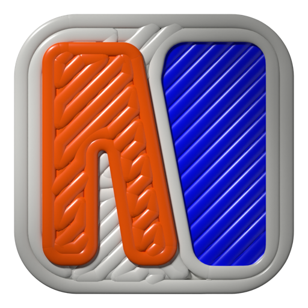

# Makeshift



**CAD with a coding agent**

A CAD application for sketching, direct solid modeling, and working with a coding
agent on the same drawing. Build shapes by hand, refine them with dimensions and
constraints, or let an agent inspect your model and make edits through scripts.

Makeshift is in active development. You can build and run it from source today;
the desktop build is verified on macOS with Apple Silicon. Linux and Windows
are intended targets but have not yet been verified.

## What you can do

- **Sketch precisely.** Draw lines, rectangles, circles, arcs, and cubic Bézier
  curves. Add dimensions and constraints, trim curves, and create offsets.
- **Build and reshape solids.** Extrude and revolve profiles, combine or cut
  bodies, round edges, shell shapes, and work with construction planes.
- **Edit directly.** Select geometry to move, rotate, scale, mirror, or adjust it
  with local controls. Sketches remain independently editable; changing a source
  sketch does not automatically rebuild an existing solid.
- **Work with an agent.** Use the embedded terminal to inspect the drawing and
  perform supported modeling operations through scripts. Each successful modeling
  script can be undone as one edit.
- **Save and share.** Keep your model, workspace files, and supported agent
  conversations together in a `.makeshift` document. Export solids as STEP, or meshes
  as STL or 3MF.

Some complex solid edits may be rejected. A failed calculation preserves the
accepted model, so you can adjust the operation and try again.

## Get started

Makeshift's original code is [LGPL-2.1-or-later](COPYING.md). See the
[macOS release guide](docs/releases.md) for packaging, signing and source distribution.

You’ll need Node.js 24, a C++20 compiler and CMake. Setup downloads verified,
pinned Eigen and Boost headers. On macOS, use Xcode Command Line Tools and
Homebrew's `cmake` package. See the [build guide](docs/development.md#setup-and-run) for
other platforms, architecture settings, and native SDK options.

From a checkout of this repository, activate the Node version in `.nvmrc`
(with nvm, run `nvm install` and `nvm use`), then:

```sh
npm ci
npm run setup:native
npm run setup:kernel
npm run setup:mesh
npm start
```

The first setup downloads and compiles the geometry libraries, which can take a
while. Installation and the first Electron launch need network access. Once setup
is complete, use `npm start` to build and open Makeshift.

### Make your first solid

1. Choose **Sketch on XY**.
2. Press **R** and drag to draw a rectangle.
3. Open **Tools** with **⌘F** on macOS or **Ctrl+F** on Windows/Linux, then choose
   **Return to modeling**.
4. Select the filled rectangle and use **Extrude**. Drag its handle or enter a
   distance, then accept with the checkmark. Releasing the drag leaves a preview
   so you can adjust it before accepting.
5. Save your drawing with **⌘S / Ctrl+S**.

The Tools menu is also the place to discover operations. Search by name or browse
its categories; unavailable tools explain what you need to select first.

### Everyday controls

| Action | Control |
| --- | --- |
| Find a tool | **⌘F / Ctrl+F** |
| Draw a line, rectangle, or circle | **L**, **R**, **C** |
| Pan | Two-finger scroll, secondary-button drag, or middle-button drag |
| Zoom | Trackpad pinch |
| Symmetric sizing where supported | Hold **Option / Alt** |
| Bypass geometry snaps while drawing or editing | Hold **Shift** |
| Cancel the current gesture or preview | **Escape** |

Select geometry to reveal its editing controls. Dimensions can be typed directly.
Use the Edit menu for Undo and Redo; view changes do not alter the model.

## Agent terminal

Open **Agent** to start your configured coding agent. Makeshift includes a Codex
preset; install the agent separately, then use **Settings** to choose its
executable and launch options. The Codex preset keeps its configuration and login
separate from your other installations. A Custom configuration can launch another
terminal-based tool.

The agent has access to commands for inspecting the drawing, reading the current
selection, rendering a view, and running modeling scripts. You can continue
editing the resulting geometry with the ordinary tools. **Cancel script** discards
an unfinished modeling operation; Undo restores the model after an accepted one.
Changes to workspace files are outside geometry Undo.
Run `makeshift help` in the terminal for the available commands.

Drop files onto the Agent pane, or use **Attach file…** in its header. Makeshift copies
them into the drawing's `attachments/` workspace folder and inserts each relative
path at the terminal cursor. Attached files travel with the saved `.makeshift` document.
A batch over 20 MiB triggers a size warning; the workspace has a 64 MiB total
limit. For a 3MF reference, ask Codex to use `$mesh-recovery` with its path.

Dock the terminal on the right or below the drawing, resize it, or collapse it
without stopping the agent. **Stop** ends the process. Closing the drawing also
stops it before the usual unsaved-work prompt.

## Your files

Use **File → Save**, **Save As**, and **Open** for `.makeshift` documents. Saved files
include the model and agent workspace files; Codex conversations travel with the
drawing too. Credentials and launch settings stay on your computer.

Existing `.freac` documents also open in Makeshift. Saved scripts using the former
`freac` command or scripting object continue to work.

Makeshift prompts before replacing or closing unsaved work. Reopening a document
starts fresh Undo history, and there is no geometry autosave, so save regularly.
To recover retained agent files, stop the agent and use
**Settings → Recover agent files…**.

To export, open Tools and choose **Export STL**, **Export 3MF** or **Export STEP**.
Exports include visible accepted solid bodies in millimeters at their world positions.
STEP keeps undecorated bodies as exact geometry. When decorators are present,
choose whether to include their final shapes as AP242 meshes or omit decorators
and export the underlying exact solids. The dialog warns that mesh bodies are
not smooth editable CAD solids and some receiving apps may not support them.

## iPad interface

The experimental iPad interface connects to Makeshift running on your computer.
Finish the current tool, click **iPad**, and scan the QR code from an iPad on the
same network. Keep the desktop app running. **Return to computer** switches
editing back to the desktop; only one device controls the drawing at a time.

Pencil is used for drawing and editing, one finger for rotation, and two fingers
for pan and pinch zoom. Save/Open accesses files on the computer, and the agent
runs there too. Physical iPad/Pencil interaction still needs device testing.

**Use only on a trusted private network.** The connection uses unencrypted HTTP.
Someone intercepting it could access the drawing, computer files, and agent.

## Report a problem

In the desktop app, open Tools and choose **Capture fixture**. Drag the resulting
JSON file into an issue or Codex, or use **Show in folder**. Clicking the file
downloads a copy (also available in browsers). **Copy fixture path** remains
available for local debugging. Include what you expected to happen. The capture
contains the model and editing state needed to reproduce it; captures stay local and are never
uploaded automatically. Files are stored in the system temporary directory; attach
or save a copy before the OS clears them. A screenshot can help explain what you saw.

## Development

For hot reload, use `npm run dev`. For detailed setup, clean builds, and tests,
see the [development guide](docs/development.md).

Contributors can start with the [architecture overview](docs/architecture.md)
and [development process](docs/development-process.md).

## Standalone web target

See [web build and release](docs/web-build.md) for the local WASM build, static preview,
Chromium/WebKit checks and independent GitHub Pages deployment. Web mode omits the
agent pane and uses browser `.makeshift` opening/saving.
